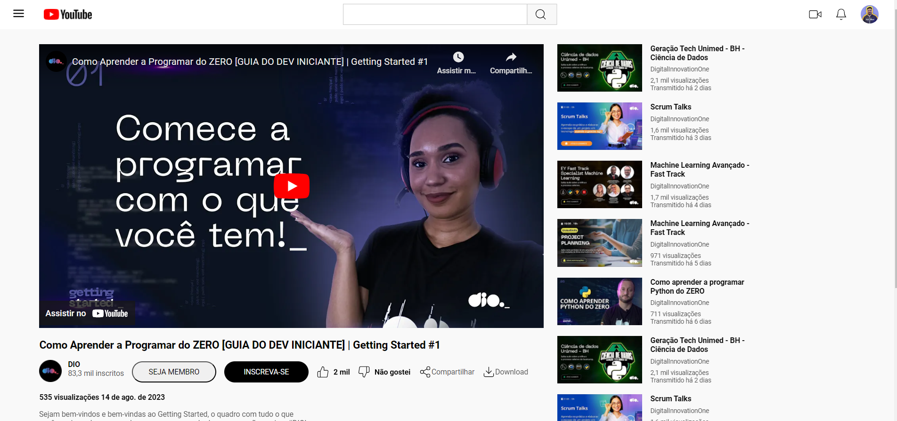

## 🏋️‍♂️ Desafio de Projeto CSS: Clonando a Página do Youtube com CSS
Desafio de Projeto proposto no curso de Formação CSS Web Developer  
No desafio, colocamos em pratica os conceitos aprendidos em CSS, principalmente sobre Flexbox.

## 💻 Tecnologias utilizadas nesse projeto:

  
  

## 💻 Preview:

- Veja como ficou o projeto acessando: [aqui](link do github pages)

## 🤔 O que aprendi com esse projeto:
- A utilizar os conceitos de Flexbox.
- Aprimorar habilidades em HTML e CSS 
- Utilizar os recursos disponibilizados pelo Figma, como copiar o código de um arquivo SVG.
- Aprendi a utilizar as orientações do arquivo do Figma disponibilizado no curso.

## 📌 Créditos
- **Assets:** Disponível no protótipo do Figma disponibilizado no curso.
- **Vídeo do Youtube utilizado no projeto:** [Vídeo do canal da DIO: Como Aprender a Programar do ZERO [GUIA DO DEV INICIANTE] | Getting Started #1
](https://www.youtube.com/watch?v=D9Zk2YKBOl8)
